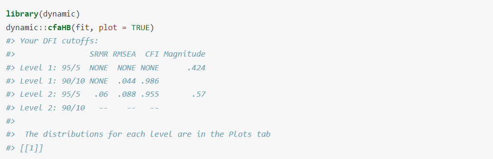
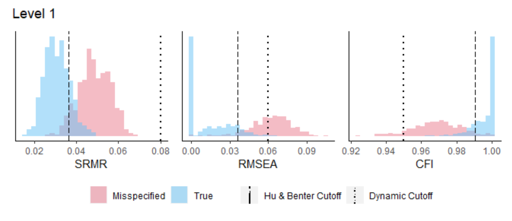
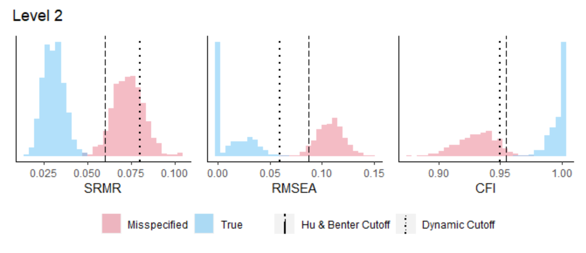
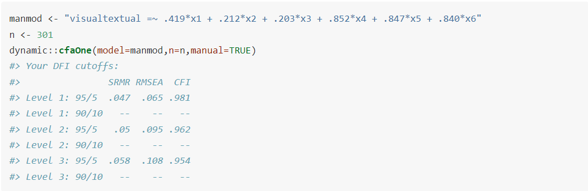

```{r, include = FALSE, message=FALSE, warning=FALSE}
knitr::opts_chunk$set(
  collapse = TRUE,
  comment = "#>"
)
```

## Introduction

This package was created as supplemental material for *Dynamic Fit Index Cutoffs for Confirmatory Factor Analysis Models*, recently published in Psych Methods and openly accessible on [PsyArXiv](https://psyarxiv.com/v8yru){target="_parent"}. This package computes fit index cutoffs for CFA models that are tailored to the user's model statement and sample size. This enables the user to estimate the extent of misspecification(s) in their particular model.  

- The misspecifications for the multi-factor CFA model, `cfaHB`, are defined conventionally in line with Hu & Bentler's (1999) approach to misspecification.  The DFI cutoff approach expands upon Hu & Bentler's method to include multiple levels of misspecification (one level for each F-1 factor, where F is the number of factors in the model).

- The misspecifications for the one-factor CFA model, `cfaOne`, are standardized to account for the number of items in the model.  There are up to three levels of misspecification for DFI cutoffs for one-factor CFAs, each increasing in severity (such that a Level-3 misspecification is the most misspecified model).

Advances in computation and the accessibility of [RStudio's Shiny applications](https://shiny.rstudio.com/){target="_parent"} negate the need to rely on fixed cutoff values. The new generation of fit index cutoffs are *dynamic* in that they change given the user's model statement, model type, and sample size.

## Example with Lavaan (manual=FALSE)

**cfaOne** and **cfaHB** each require two pieces of information: the user's model statement and sample size.  Both functions can read in this information from a `lavaan` object.  The default argument for each function is the `lavaan` object, which corresponds to the default for the manual argument (`manual=FALSE`).  We will use the `cfaHB` function as an example here.  

For this example, we will use the `HolzingerSwineford1939` dataset that is built into the `lavaan` package.  This is a multi-factor CFA model (click [here](https://lavaan.ugent.be/tutorial/cfa.html){target="_parent"} for a `lavaan` CFA tutorial).  This data consists of a "mental ability" test with three factors: visual, textual, and speed. There are nine items; the first three load on visual, the second three load on textual, and the last three load on speed.  The sample size is 301.

The user would begin by loading the dataset and running the three-factor CFA model:

```{r message=FALSE, warning=FALSE}
library(lavaan)
dat <- lavaan::HolzingerSwineford1939
lavmod <- "visual  =~ x1 + x2 + x3
           textual =~ x4 + x5 + x6
           speed   =~ x7 + x8 + x9"
fit <- lavaan::cfa(model=lavmod,data=dat)
```

The `lavaan` object, `fit`, would then be used as the sole argument for `cfaHB` (since this is a multi-factor model).  This will run a simulation with 500 replications per level to compute the DFI cutoffs tailored to this specific model, and return the two levels of misspecifications for the SRMR, RMSEA, and CFI.  It will also include the magnitude of each missing cross-loading from the data generating model, to give the user an idea of the severity of the misspecification.  Because we requested the plots with `plot=TRUE`, there will be two plots with distributions of fit indices - one for each level of misspecification.  

```{r fig.height=3, fig.width=7, message=FALSE, warning=FALSE, eval=FALSE}
library(dynamic)
dynamic::cfaHB(fit, plot = TRUE)
```

```{r out.width="98%", message=FALSE, warning=FALSE, echo=FALSE}

```

```{r out.width="98%", message=FALSE, warning=FALSE, echo=FALSE}

```

```{r out.width="98%", message=FALSE, warning=FALSE, echo=FALSE}

```

The SRMR for this model was .065, while the RMSEA was .092 and the CFI was .931 (these are found by running `fitMeasures(fit)`).  The SRMR and RMSEA exceed the Level-1 and Level-2 cutoff values, and the CFI falls below the Level-1 and Level-2 cutoff values.  This means that the fit for this model is equivalent to *at least* two missing cross-loadings in the data generating model, one with a magnitude of .424 and the second with a magnitude of .570.  This model would not have fit well by Hu & Bentler's traditional cutoffs (SRMR < .08, RMSEA < .06, CFI > .95), but the fit is even poorer when compared to the DFI cutoffs tailored to the user's model.

Note that there are no cutoffs available at Level-1 for the 95/5 criteria.  This is because the fit index distributions for the misspecified and true models overlap too much to return a cutoff value that can correctly identify a misspecified model as misspecified 95% of the time while also correctly identifying a correctly specified model as correctly specified 95% of the time.  You can see this overlap on Level 1 figures. Note that for Level-2, the distributions are much further apart.

## Example with manual input (manual=TRUE)

Each function can also accommodate those that did not analyze their CFA models using `lavaan`.  This can be done by triggering `manual=TRUE`, which will tell the function to expect *two* arguments (model statement and sample size).  For users that want to manually input their model statements, they should be written in lavaan compatible [model syntax](https://lavaan.ugent.be/tutorial/syntax1.html){target="_parent"} using **standardized** loadings.  The second argument will be the user's manually entered sample size (this is only necessary for users who manually input their model statement). We will use the `cfaOne` function as an example here.

Again, we will rely on the `HolzingerSwineford1939` dataset that is built into the `lavaan` package.  This time, we will pretend that the hypothesized model is a one-factor model with 6 items.  We run a one-factor CFA, extract the standardized loadings, and use them to write the model statement `manmod`.  We then enter the sample size from the dataset (301), and select `manual=TRUE`.  Because we did not request any plots, none will appear.

```{r fig.height=3, fig.width=7, message=FALSE, warning=FALSE, eval=FALSE}
manmod <- "visualtextual =~ .419*x1 + .212*x2 + .203*x3 + .852*x4 + .847*x5 + .840*x6"
n <- 301
dynamic::cfaOne(model=manmod,n=n,manual=TRUE)
```

```{r out.width="98%", message=FALSE, warning=FALSE, echo=FALSE}

```

The SRMR for this model was .114, while the RMSEA was .187 and the CFI was .856.  The SRMR and RMSEA exceed the Level-1, Level-2, and Level-3 cutoff values, and the CFI falls below the Level-1, Level-2 and Level-3 cutoff values.  This means that the fit of this model is equivalent to *at least* all of the items having one missing correlation with another item (at a magnitude of .3), implying that the hypothesized model may not fit the data.  It is worth noting that this model also would not have fit well by Hu & Bentler's traditional cutoffs (SRMR < .08, RMSEA < .06, CFI > .95).

## Shiny Application

There is a Shiny app counterpart to this package.  It can be found at [dynamicfit.app](https://dynamicfit.app/){target="_parent"}.  The package and the app are identical and will produce the same results.

## Important Notes

 - cfaHB and cfaOne are only appropriate for single-level CFA models estimated using maximum likelihood estimation.  
 - Do not manipulate the number of replications (default = 500).  The number of replications on the Shiny App is set to 500.  If this is manipulated, the cutoffs will differ from the results produced by the Shiny App.

## Citation Recommendations

To cite the ideas behind dynamic model fit index cutoff values:

- [McNeish, D.](https://sites.google.com/site/danielmmcneish){target="_parent"} & [Wolf, M. G.](https://www.melissagwolf.com/){target="_parent"} (2021). Dynamic Fit Index Cutoffs for Confirmatory Factor Analysis Models. *Psychological Methods*. 

    - [*PsyArXiv link*](https://psyarxiv.com/v8yru/){target="_parent"}

To cite the dynamic model index cutoff values generated by this R package:

- [Wolf, M. G.](https://www.melissagwolf.com/){target="_parent"} & [McNeish, D.](https://sites.google.com/site/danielmmcneish/){target="_parent"} (2022). Dynamic Model Fit. R package version 1.1.0.


  
## This package relies on the following packages:

- [lavaan](https://www.jstatsoft.org/article/view/v048i02){target="_parent"}. Rosseel, Y. (2012). lavaan: An R Package for Structural Equation Modeling. Journal of Statistical Software, 48(2), 1-36.
- [simstandard](https://CRAN.R-project.org/package=simstandard){target="_parent"}. Schneider, W. J. (2019). simstandard: Generate Standardized Data. R package version 0.3.0. 
- [tidyverse](https://doi.org/10.21105/joss.01686){target="_parent"}. Wickham et al., (2019). Welcome to the tidyverse. Journal of Open Source Software, 4(43), 1686.
